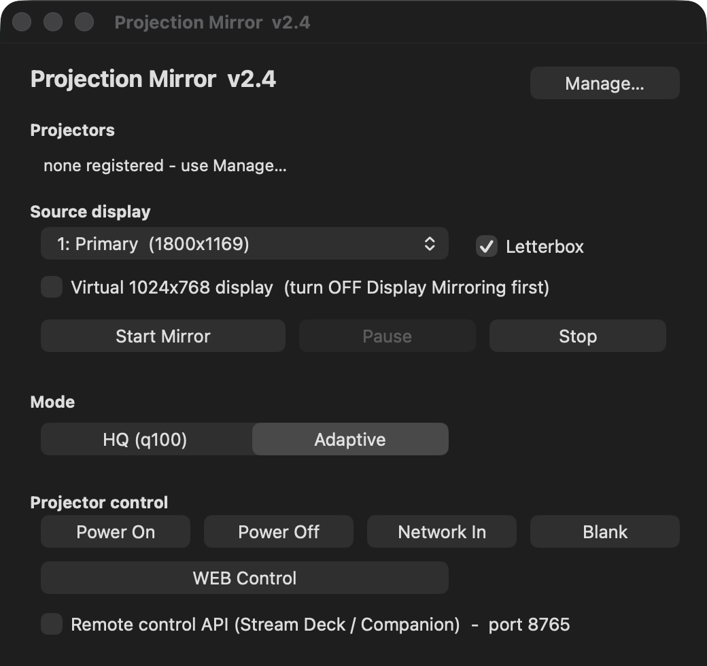

# Projection Mirror

A native macOS app that mirrors a Mac display to Panasonic PT-F300-family network projectors over a
wired LAN, replacing the vendor's discontinued *Wireless Manager ME 6.4* — which no longer runs on
current macOS.

The projectors' network display protocol was independently reverse engineered **for
interoperability** with hardware the owner already possesses, whose vendor software is discontinued.
See [docs/PROTOCOL.md](docs/PROTOCOL.md). This project contains **no vendor code**; see [Legal](#legal).

**Status:** v2.4, hardware-validated. Dual-projector mirroring runs a full session on real hardware.
Universal2 build runs native on both Apple Silicon and Intel Macs.



---

## What it does

- Mirrors any Mac display to any number of registered projectors at once, on the wired LAN
- Finds projectors on the subnet and derives each one's association key — no per-unit configuration
- Two picture modes: **HQ** (best quality, ~4 fps — slides and stills) and **Adaptive** (default;
  ~9 fps, quality that floats to hold frame rate — video)
- A capture path that maps a 1024×768 virtual display 1:1 to the projector panel
- Each projector streams on its own thread; a failing projector cannot stall a healthy one, and a
  dropped projector auto-reconnects
- Power / input / AV-mute control over PJLink, always reading current state before acting
- An optional LAN-only remote-control API (Stream Deck / Companion), off by default
- A CLI test harness that runs without projectors or screen-recording permission

## Layout

| Path | Purpose |
|---|---|
| `src/pm_mirror_v2.py` | Protocol engine: discovery, association, crypto, JPEG strips, PJLink |
| `src/pm_session.py` | Headless mirror session — the shared producer/sender core |
| `src/pm_app.py` | Native AppKit GUI (the shipped app) |
| `src/pm_pkey.py` | Pure-Python key derivation — derives a projector's association key |
| `src/pm_capture.py` | Push capture (ScreenCaptureKit / CGDisplayStream), GPU-scaled |
| `src/pm_vdisplay.py` | Virtual 1024×768 display for a 1:1 pixel map |
| `src/pm_registry.py` | The registered-projector list (add / remove / rename / migrate) |
| `src/pm_cli.py` | CLI + test harness (`state`, `probe`, `discover`, `soak`, `selftest`) |
| `src/pjctl.py` | Standalone PJLink control |
| `src/build-universal.sh` | Build, sign, and package a universal2 `.app` |
| `tests/` | Offline regression checks + an AppKit layout smoke test, no hardware needed |

## Quick start

```bash
python3 -m venv .venv && ./.venv/bin/pip install pillow mss pycryptodome \
  pyobjc-framework-Cocoa pyobjc-framework-Quartz
./.venv/bin/python tests/test_offline.py             # regression checks, no hardware
./.venv/bin/python src/pm_cli.py discover         # find projectors on the subnet
./.venv/bin/python src/pm_cli.py state both       # live status over PJLink
```

Run the offline tests before every build. Several regressions found late in development were
invisible to hardware testing because every hardware test used *changing* content.

## Documentation

| Document | Contents |
|---|---|
| [docs/PROTOCOL.md](docs/PROTOCOL.md) | The wire protocol: discovery, association, control, video strips |
| [docs/CRYPTO.md](docs/CRYPTO.md) | The per-projector key derivation |
| [docs/ARCHITECTURE.md](docs/ARCHITECTURE.md) | Threading model, pacing, delta encoding, keyframes |
| [docs/OPERATIONS.md](docs/OPERATIONS.md) | Running it, macOS permissions, recovering a wedged projector |
| [docs/FINDINGS.md](docs/FINDINGS.md) | Hard-won lessons, and the theories that turned out wrong |
| [docs/COMPATIBILITY.md](docs/COMPATIBILITY.md) | The vendor's official model list, and what other models would need |
| [docs/REMOTE-CONTROL.md](docs/REMOTE-CONTROL.md) | The optional LAN-only remote-control API |

## Compatibility

Verified only against the **PT-F300NT / PT-FW300NT** group (which the PT-F300U belongs to). The
vendor's own *Wireless Manager ME 6.4* compatibility list names many other projectors and flat
panels that share the same wireless transport, so the protocol is *plausibly* applicable to them —
untested here. The full model list and per-group notes are in
[docs/COMPATIBILITY.md](docs/COMPATIBILITY.md).

## The one operational rule that matters

**The projectors wedge on rapid association cycling, not on data volume.** Sustained mirroring to
both projectors at once is fine; opening sessions a few seconds apart wedges a projector's network
module immediately. A wedged module still answers PJLink but refuses association, and **only a
physical power cycle clears it** — neither a PJLink power cycle nor a network-cable toggle will,
because the module stays powered in standby. Always leave 20–30 seconds between sessions.

## Legal

This is an **independent, unofficial** interoperability project. It is **not affiliated with,
authorized, or endorsed by** Panasonic.

- The network display protocol was reverse engineered **solely to interoperate** with projectors the
  owner already possesses, whose vendor software is discontinued and no longer runs on current macOS.
- This repository contains **only original code**. No vendor software, libraries, binaries,
  decompiled sources, or packet captures are included or redistributed. The key derivation in
  `src/pm_pkey.py` is an independent reimplementation of a functional algorithm, written from
  protocol analysis.
- "Panasonic", "PT-F300U", "Wireless Manager" and related marks are trademarks of their respective
  owners, used here only nominatively to identify compatible hardware.
- Users are responsible for their own compliance with any agreements governing their equipment and
  software.

See [LICENSE](LICENSE) for the code license and [NOTICE](NOTICE) for the full disclaimer. Provided
**as is**, without warranty of any kind.
